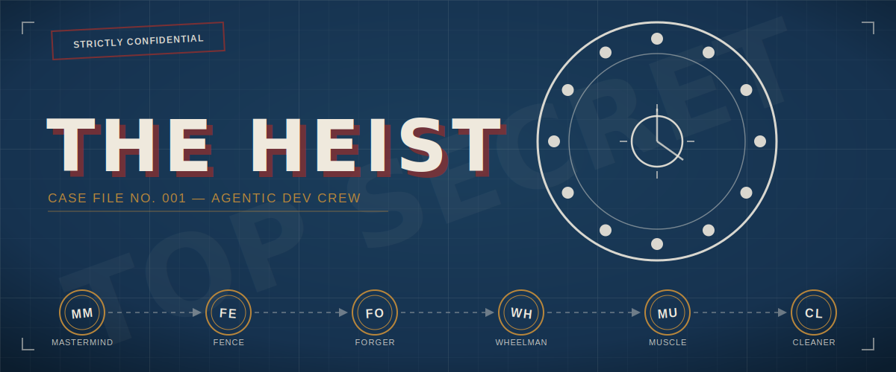
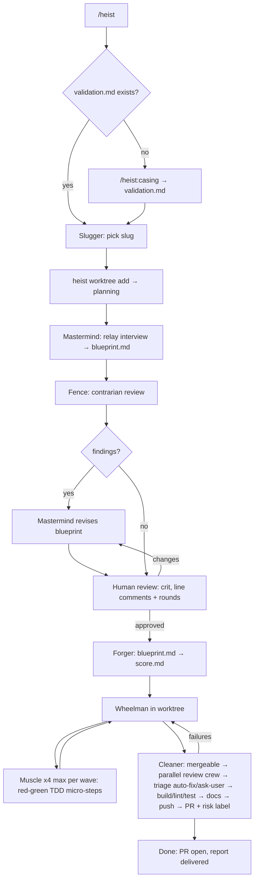

# Heist



Heist is an opinionated workflow for shipping a non-trivial change end-to-end with Claude Code: design, review, implementation, validation, each stage owned by its own role instead of one agent doing everything from memory.

It ships as a single Claude Code plugin: one entry point, a crew of specialized subagents, each with one job.

## The story of one heist

You type `/heist:heist add rate limiting to the public API` and the crew gets to work:

1. **Slugger** picks a short slug for the job, then **Mastermind** interviews you with multiple-choice questions like a detective, then writes `blueprint.md`.
2. **Fence** reads it and immediately starts talking about everything wrong with the plan, because that's the job. Mastermind fixes what actually lands.
3. You take a pass yourself in [crit](https://crit.md), leaving comments until you're out of things to nitpick. Silence is approval.
4. **Forger** breaks the blueprint into `score.md`, a checklist so granular a Muscle can't screw it up.
5. **Wheelman** sends **Muscle** to handle the work wave by wave — up to 4 independent steps at once, one build per wave, no improvising, no side quests, just the checklist.
6. **Cleaner** rebases, orchestrates a parallel review crew of its own, auto-fixes what's safe, floats the rest to you, runs build/lint/test, and opens a PR with a risk label. Anything labeled critical, it stops and wakes you up first.

You come back to an open PR and a heat report: what got built, what got flagged, what's still on you to eyeball.

## Pipeline



Worktree teardown is deliberately manual, not part of the pipeline above: once a heist's PR merges, reclaim the worktree yourself with `heist worktree remove <slug>`. Cleaner stops at PR-open.

## Terms explanation

| Heist term | Real concept |
|---|---|
| Slugger | Names the job: picks the short slug it's tracked under |
| Mastermind | Plans the job: interviews you and writes the blueprint before anyone lifts a finger |
| Fence | Fences the plan before you fence the goods: reads the blueprint and tries to poke holes in it |
| Forger | Forges the paperwork: turns the approved blueprint into the score, step by step |
| Wheelman | Drives the job: runs the crew through the worktree from start to finish |
| Muscle | Does the lifting: one step, no improvising, no thinking beyond what the score says |
| Cleaner | Cleans up after: checks the work, scrubs for risk, drives the getaway car (the PR) |
| Casing | Casing the joint before the job: one-time repo scouting, writes `validation.md` |
| Blueprint | The plan for the job: `blueprint.md`, the design doc |
| Score | The job's step-by-step rundown: `score.md`, the ordered TDD work doc |
| Risk label | How hot the job is: PR risk classification `low` / `medium` / `high` / `critical` |

## Quickstart

```bash
# install the heist binary
cargo install --path `path_to_this_project`/cli 

# add this repo as a local marketplace, then install the plugin
claude plugin marketplace add `path_to_this_project`
claude plugin install heist@heist-marketplace

# or, for dev iteration without installing:
claude --plugin-dir `path_to_this_project`
```

Then, inside any project:

```
/heist:heist <describe the change you want>
```

Note: plugin skills are always namespaced (`/heist:heist`, `/heist:casing`), there's no unprefixed shorthand. Worktree and state management is handled by the `heist` binary.

## Layout

Heist is organized as a monorepo with two main components:

- **`plugin/`**: The Claude Code plugin. Contains the crew of specialized agents and assets. This is what's installed via `claude plugin install heist@...`.
- **`cli/`**: The Rust crate `heist`, a binary that handles deterministic parts of the flow to be token-efficient.

Docs live in `.heist/<slug>/` inside your project. Gitignoring those files is recommended.

`validation.md` can also live in subdirectories for a monorepo/nested-package layout — `heist validation resolve <absolute-path>` walks repo root down to `<absolute-path>`, merging every `validation.md` found along the way (nearest file wins per section).

## Model / cost table

| Crew member | Model | Why |
|---|---|---|
| Slugger | Haiku | Picking a slug from a description is trivial, no design reasoning needed |
| Mastermind | Opus | Design quality matters most here, it's the one doc everything downstream depends on |
| Fence | Sonnet | Adversarial review is bounded and structured; doesn't need Opus-level reasoning |
| Forger | Sonnet | Mechanical transformation of an already-approved design |
| Wheelman | Sonnet | Needs to dispatch, verify honestly, and make judgment calls on fallback steps |
| Muscle | Haiku | Zero thinking by design, the plan is already fully specified in `score.md` |
| Cleaner | Sonnet | Adversarial review + validation pipeline, bounded scope |

